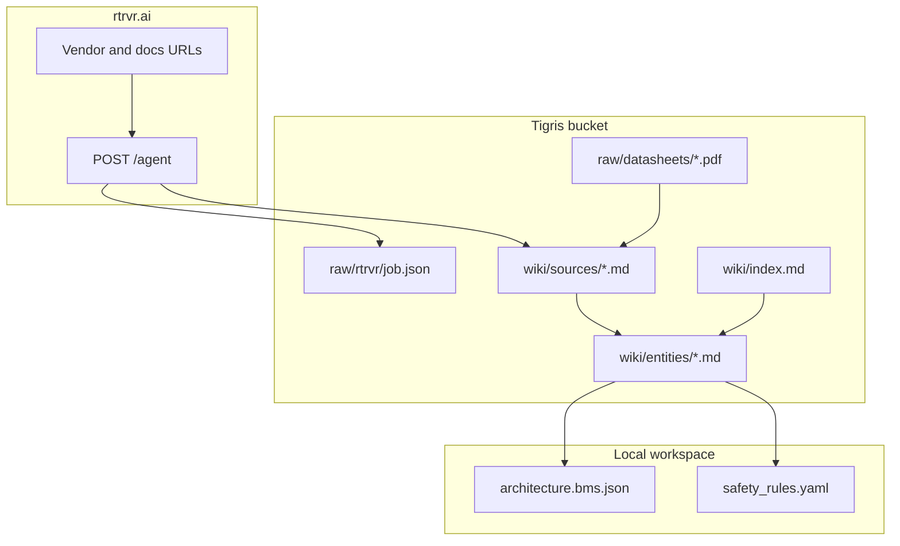

# Tigris Remote Wiki Architecture

## Principle

| Local workspace | Tigris (remote) |
|-----------------|-----------------|
| `architecture.bms.json`, `safety_rules.yaml` | `raw/` PDFs + `raw/rtrvr/` API JSON |
| `bms/SKILL.md`, `bms/WIKI.md` (pointers) | `wiki/` all markdown |
| Templates, schema | `schema/WIKI.md`, `manifest.yaml` |

## Three layers (+ rtrvr retrieval)

1. **Raw** — immutable PDFs (`raw/datasheets/`) and rtrvr JSON archives (`raw/rtrvr/`)
2. **Wiki** — agent-compiled markdown (index, entities, concepts, sources)
3. **Schema** — `WIKI.md` defines ingest/query/lint workflows
4. **rtrvr.ai** — live URL browse → compile into wiki (see [RTRVR.md](./RTRVR.md))

## End-to-end pipeline



## Query loop

```
User question → read wiki/index.md (Tigris MCP)
             → read linked pages (entities, concepts, sources)
             → read linked pages from Tigris
             → answer / design using compiled wiki (never call rtrvr at runtime)
```

## Ingest loop

```
PDF → raw/datasheets/ → wiki/sources/<slug>.md
rtrvr job → raw/rtrvr/<id>.json → wiki/sources/<id>.md
         → update entities/concepts → log.md → index.md → manifest.yaml
```

Full pipeline: `dev/default/wiki/ingest-pipeline.md` on Tigris.

## Current bucket state (live)

| Path | Contents |
|------|----------|
| `raw/datasheets/bq76952.pdf` | TI BQ76952 datasheet (~4.1 MB) |
| `raw/rtrvr/*.json` | rtrvr.ai API responses (audit trail) |
| `wiki/concepts/` | protection, balancing, SOC/SOH, thermal, topology, bms-fundamentals |
| `wiki/entities/` | BQ76952, LTC6811, STM32F407 (rtrvr-enriched) |
| `wiki/sources/` | 1:1 summaries + `*-rtrvr-*.md` pages |
| `manifest.yaml` | Catalog: raw ↔ wiki ↔ rtrvr trajectory IDs |

## Commands

```bash
make tigris-bootstrap   # initial skeleton
make tigris-enrich      # BMS seed pages + PDF
make rtrvr-sync         # rtrvr.ai → Tigris compile
make tigris-probe       # verify + MCP tool count
```

## Sponsors demo

> "CANary stores PDFs and rtrvr extractions on **Tigris**, compiles a **Karpathy wiki**, and uses **Retriever AI** to refresh vendor specs from live URLs. The agent reads `index.md` before every design — knowledge compounds remotely; SVG diagrams stay local."

## Related docs

- [SETUP.md](./SETUP.md) — Tigris credentials + MCP
- [RTRVR.md](./RTRVR.md) — rtrvr.ai API + sync jobs
